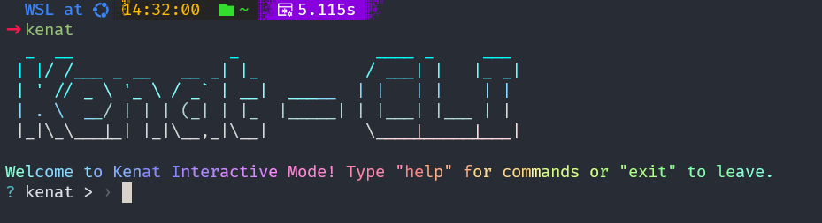

# Kenat-CLI / ቀናት



**Kenat-CLI** is a powerful, beautiful, and user-friendly command-line interface for the [Kenat Ethiopian calendar library](https://github.com/MelakuDemeke/kenat). It brings comprehensive date conversion, holiday information, liturgical calculations, and visual calendars right to your terminal.

Whether you're a developer, a researcher, or just curious about the Ethiopian calendar, **kenat-cli** is the perfect tool for you.

---

## ✨ Features

- **Dual Modes**: Use the simple, direct command-line interface for quick tasks or launch the fully interactive REPL mode for a guided experience.
- **Visual Calendars**: Display a calendar for any month or a compact, full-year view, complete with holiday and "today" highlighting.
- **Date Conversion**: Seamlessly convert dates between the Ethiopian and Gregorian calendars.
- **Complete Holiday System**: Get lists of holidays for any month or year. Filter by type (public, religious, etc.) or get detailed information on a specific holiday.
- **Bahire Hasab (ባሕረ ሃሳብ)**: Access the ancient and complex liturgical calculations for any year to find the dates of movable feasts like Fasika (Easter).
- **Beautifully Styled**: Enjoy a modern CLI experience with colorful, gradient-based text and well-formatted tables.

---

## 📦 Installation

You’ll need **Node.js (version 14 or higher)** and **npm** installed on your system.

```bash
npm install -g kenat-cli
````

Once installed, you can run the `kenat` command from anywhere in your terminal.

---

## 🚀 Usage

Kenat-CLI can be used in two primary ways: **Interactive Mode** for a guided experience, or **Direct Commands** for quick, specific actions.

### 🔁 Interactive Mode

For the most user-friendly experience, simply run the command without any arguments:

```bash
kenat
```

This launches the interactive REPL (Read-Eval-Print Loop), where you can type commands like `today`, `calendar`, or `help`.

To exit the interactive mode, type `exit` or press `Ctrl + C`.

---

### ⚡ Direct Commands

You can also run specific commands directly from your terminal.

#### `today`

Displays the current date in both Ethiopian and Gregorian formats.

```bash
kenat today
```

---

#### `convert`

Converts a date from one calendar system to another.

```bash
kenat convert [date] --to <calendar>
```

* `[date]`: Date string (e.g., `2016/9/15` or `2024-05-23`)
* `--to, -t <calendar>`: Required. Either `gregorian` or `ethiopian`.

**Examples:**

```bash
kenat convert 2016/9/15 --to gregorian
kenat convert 2025-07-10 -t ethiopian
```

---

#### `calendar`

Displays a visual calendar for a specific month or year.

```bash
kenat calendar [options]
```

**Options:**

* `--year, -y <year>`: Ethiopian year
* `--month, -m <month>`: Ethiopian month (1-13)

**Examples:**

```bash
kenat calendar
kenat calendar --year 2017 --month 1
kenat calendar -y 2017
```

---

#### `holiday`

Lists holidays or provides detailed info about a specific holiday.

```bash
kenat holiday [options]
```

**Options:**

* `--this-month, -m`: Lists holidays for the current month.
* `--this-year, -y`: Lists holidays for the current year.
* `--info, -i <key>`: Info on a specific holiday (`meskel`, `fasika`, `eidAdha`, etc.)
* `--filter, -f <tags...>`: Filter by tags (`public`, `religious`, `christian`, `muslim`, `state`, `cultural`)

**Examples:**

```bash
kenat holiday --this-year
kenat holiday -m --filter christian muslim
kenat holiday --info meskel
```

---

#### `bahirehasab`

Calculates liturgical dates for a given Ethiopian year.

```bash
kenat bahirehasab [year]
```

**Example:**

```bash
kenat bahirehasab 2017
```

---

#### `help`

Displays a list of all commands or help for a specific command.

```bash
kenat help [command]
```

**Examples:**

```bash
kenat help
kenat help calendar
```

---

## 🤝 Contributing

Contributions, issues, and feature requests are welcome!
Feel free to check the [issues page](https://github.com/MelakuDemeke/kenat-cli/issues).

